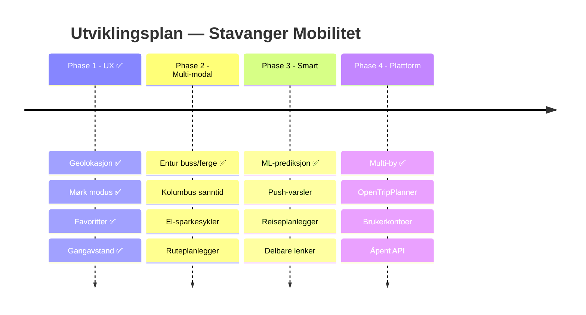

<!-- markdownlint-disable MD003 MD013 MD022 MD024 MD025 MD033 -->
<!-- MD025: Slidev uses # per slide (multiple h1 by design) -->
<!-- MD003: Slidev --- separators are misread as setext headings -->

  
Hvor mange apper trenger du for parkering, bysykler og buss i Stavanger?

  
Stavanger Mobilitet

  
Sanntids parkering, bysykler og kollektivtransport — på ett kart

  

    🏙️ 4 byer
    ✨ 10+ funksjoner
    🤖 100% AI-drevet
  

  

    Bouvet AI Hack · Team 8 · 11. mars 2026
  

  <a href="https://github.com/Bouvet-deler/aihack-team8" target="_blank" class="text-xl slidev-icon-btn opacity-40 !border-none !hover:text-white">
    <carbon-logo-github />
  </a>

<!--
Presenter notes:
Åpne med hook-spørsmålet: "Hvor mange apper trenger du...?"
La det synke inn et øyeblikk, deretter presenter løsningen.
-->

---
layout: two-cols
layoutClass: gap-8
---

# Problemet 🎯

Stavangers innbyggere trenger **én plass** for å finne:

  
🅿️ Ledig parkering i sanntid

  
🚲 Tilgjengelige bysykler

  
🚌 Buss- og fergeavganger

  
📍 Hva som er <b>nærmest meg</b>

Informasjonen er spredt over ulike apper og nettsider. Ingen viser <b>alt</b> på ett kart.

::right::

## Ingen dekker Stavanger

| Løsning     | 🅿️ | 🚲 | 🚌 | Stavanger |
| ----------- | :-: | :-: | :-: | :-------: |
| Citymapper  | ❌  | ✅  | ✅  |    ❌     |
| Moovit      | ❌  | ❌  | ✅  |    ⚠️     |
| SpotHero    | ✅  | ❌  | ❌  |    ❌     |
| Parkopedia  | ✅  | ❌  | ❌  |    ⚠️     |
| Entur       | ❌  | ❌  | ✅  |    ✅     |
| **Vår app** | ✅  | ✅  | ✅  |  **✅**   |

<!--
Presenter notes:
Klikk gjennom hvert punkt for å bygge opp problemet.
Tabellen viser at ingen eksisterende løsning dekker Stavanger med parkering + sykkel + buss.
-->

---
layout: two-cols
layoutClass: gap-8
---

# Hva vi har bygget ✨

## Kjernefunksjoner

  
🗺️ Interaktivt kart — <b>parkering + sykkel + buss</b>

  
🎨 Fargekodede markører grønn → rød

  
🔍 Søk og filtrering

  
📱 PWA — installerbar på mobil

  
🌍 Flerspråklig (NO / EN / ES)

  
🔄 Auto-oppdatering av data

::right::

## Nye i denne hacken

  
🌙 <b>Mørk modus</b> — respekterer system-tema

  
⭐ <b>Favoritter</b> — lagre favorittplasser

  
📏 <b>Gangavstand</b> — tid og distanse

  
📍 <b>Geolokasjon</b> — vis min posisjon

  
📈 <b>Prediksjon</b> — forutsi ledige plasser

  
🏙️ <b>4 byer</b> — Stavanger, Bergen, Trondheim, Oslo

✅ Phase 1 komplett + deler av Phase 2–4

<!--
Presenter notes:
Klikk gjennom kjernefunksjonene én og én. Høyre kolonne viser hva som er nytt i denne hacken.
-->

---
layout: center
class: text-center
---

# Demo 🎬

La oss se appen i aksjon

  🗺️ Kartet
  🔍 Søk & filter
  🌙 Mørk modus
  📱 Mobil PWA

Bytt til nettleseren og vis appen

  <a href="http://localhost:8080" target="_blank" class="px-5 py-2.5 rounded-lg bg-white/5 border border-white/10 text-white text-sm hover:bg-white/10 transition-all inline-flex items-center gap-2">
    🌐 Åpne appen — localhost:8080
  </a>

<!--
Presenter notes:
LIVE DEMO — bytt til nettleseren.
Vis: kartet med alle lag, søk, filtrer, bytt by, mørk modus, installer PWA.
Bruk ca. 2-3 minutter her — dette er presentasjonens høydepunkt.
-->

---
layout: center
class: text-center
---

# Tech Stack 🛠️

  

    
⚛️

    
React 19

    
UI Framework

  

  

    
⚡

    
Vite 6

    
Build & Dev

  

  

    
🗺️

    
Leaflet

    
Kart

  

  

    
🎨

    
EDS

    
Equinor Design

  

  

    
📦

    
PWA

    
Workbox + Offline

  

  

    
🌍

    
i18next

    
3 språk

  

  

    
📊

    
Open Data

    
opencom.no + Entur

  

  

    
🔒

    
TypeScript

    
Strict mode

  

<!--
Presenter notes:
React 19 + Vite 6 gir lynrask utvikling. Leaflet for kartvisning. EDS for Equinor-standard.
PWA gjør appen installerbar. i18next for 3 språk. Open Data fra opencom.no og Entur.
-->

---
layout: two-cols
layoutClass: gap-5
---

# AI-drevet utvikling 🤖

Copilot CLI var med i <b>hele arbeidsflyten</b> — ikke bare koding

## Hva AI gjorde for oss

| Oppgave           | Resultat                        |
| ----------------- | ------------------------------- |
| Kodeanalyse       | Utforsket kodebasen på minutter |
| Konkurrentanalyse | 7 plattformer analysert         |
| Prosjektplan      | 26 Issues m/ akseptansekriterier |
| CI/CD             | Super-linter + Lefthook         |
| Kodekvalitet      | CSS nesting, OKLCH, @property   |
| Dokumentasjon     | README, CONTRIBUTING, Slidev    |
| Testing           | UAT-template + Playwright       |
| Deep research     | 5 rapporter, 80 000+ ord        |
| Video             | TTS + Playwright screen-capture |

::right::

## 5 dype research-analyser

🔍 <b>Konkurranseanalyse</b> — 7 plattformer

💰 <b>Utviklingskostnader</b> — DRY + CI-strategi

🎤 <b>Presentasjonsteknikk</b> — Narrativ + design

📝 <b>Ren Markdown</b> — Comark/MDC i Slidev

🎨 <b>Moderne CSS</b> — Nesting, OKLCH, @property

Copilot CLI = <b>utviklingspartner</b>, ikke kodegenerator

<!--
Presenter notes:
Tabellen viser bredden av AI-bruk. Høyre kolonne: klikk gjennom 5 research-rapporter.
Copilot CLI er en utviklingspartner — analyserer, planlegger, skriver kode, setter opp CI/CD, alt fra terminalen.
-->

---
layout: two-cols
layoutClass: gap-8
---

# Kvalitetssikring ✅

## Automatisert UAT (Playwright)

  
57

  
Bestått

  
12

  
Feil*

  
3

  
Skipped

* CSP-header + Leaflet DivIcon i headless — fungerer i ekte nettleser

::right::

## CI/CD Pipeline

🥊 <b>Lefthook</b> — pre-commit hooks (parallell) 
prettier · markdownlint · stylelint · tsc

🔍 <b>Super-linter</b> v8.3.1 — GitHub Actions 
CSS · HTML · JSON · Markdown · YAML · Actions

📝 <b>Docs-as-code</b> — alt versjonskontrollert 
README · CONTRIBUTING · Slidev · UAT

<!--
Presenter notes:
57 av 72 UAT-tester bestått. 12 feil er CSP/DivIcon-relatert (fungerer i ekte nettleser).
CI/CD: Lefthook for pre-commit, Super-linter for GitHub Actions, docs-as-code.
-->

---
layout: two-cols
layoutClass: gap-6
---

# Utviklingskostnad 💰

Mennesker jobber gratis — hva koster AI og infrastruktur?

## Kostnader

| Post                    |   Kostnad |
| ----------------------- | --------: |
| Knut — Claude API       |   $43.13  |
| Einar — Copilot CLI     |     $0\*  |
| GitHub Actions (46 min) |    $0.37  |
| Copilot × 2 seter       |  $38/mnd  |
| Hosting                 |       $0  |

* Copilot Business inkludert — tilsvarende API-kost: ~$207

::right::

## AI-bidrag i tall

| Metrikk          |      Verdi |
| ---------------- | ---------: |
| Totale commits   |         78 |
| AI co-authored   |   43 (55%) |
| — Copilot CLI    |         43 |
| — Claude API     |         34 |
| Kodelinjer (src) |      2 963 |
| Premium requests |        279 |
| Tokens prosessert | 64M+ inn  |

<b class="text-lg">~$81 + $38/mnd</b> 
→ 3 000 LOC, full CI/CD, 4 byer (~$250 i API-verdi)

<!--
Presenter notes:
Total kostnad er ~$81 + $38/mnd for Copilot-abonnement.
Copilot CLI alene brukte 174 premium requests og 64M tokens — tilsvarende ~$207 i API-kost.
55% av commits er AI co-authored via Copilot CLI. Knut brukte Claude API direkte for $43.
Samlet AI-verdi: ~$250 i API-kostnader, levert for $81 + abonnement.
-->

---
layout: two-cols
layoutClass: gap-6
---

# GitHub Project Status 📋

## Issues (26 + 2 test)

| Status           | Antall |
| ---------------- | :----: |
| ✅ Lukket         |     6  |
| 📋 Åpen (P1–P4)  |    17  |
| 🧪 Test-issues   |     2  |

✅ geolokasjon · dark mode · favoritter · gangavstand · prediksjon · multi-city

::right::

## Teamets bidrag

Knut Erik — Funksjoner

i18n · dark mode · favoritter · gangavstand · geolokasjon · prediksjon · multi-city · Entur transit

Einar — AI & Kvalitet

Copilot CLI prosjektledelse · konkurranseanalyse · 26 issues · CI/CD · docs · UAT

<!--
Presenter notes:
6 issues lukket, 17 åpne med prioritet P1–P4. 2 test-issues for UAT.
Knut Erik: alle funksjoner. Einar: prosjektledelse via AI, kvalitetssikring, dokumentasjon.
-->

---

# Veikart 🗺️

<!--
Presenter notes:
4 faser: UX (ferdig), Multi-modal (pågår), Smart (prediksjon ferdig), Plattform (multi-by ferdig).
Vi har levert funksjonalitet fra alle 4 faser allerede.
-->

---
layout: two-cols
layoutClass: gap-8
---

# Neste steg 🚀

## Phase 2: Multi-modal hub

Gjøre appen til <b>den</b> mobilitetsappen for Stavanger

  
🚏 <b>Kolumbus sanntid</b>

  
🛴 <b>El-sparkesykler</b>

  
🗺️ <b>Ruteplanlegger</b>

  
⚡ <b>Elbil-lading</b>

  
♿ <b>WCAG 2.1 AA</b>

::right::

## Allerede levert utover Phase 1

🏙️ **Multi-city** — Bergen, Trondheim, Oslo [Phase 4]{.badge .badge-amber .ml-1}

📈 **Prediksjon** — forutsi tilgjengelighet [Phase 3]{.badge .badge-amber .ml-1}

🚌 **Entur API** — buss/ferge-data [Phase 2]{.badge .badge-green .ml-1}

🔍 **CI/CD** — Super-linter + Lefthook [Infra]{.badge .badge-blue .ml-1}

Inspirasjon: Digitransit 🇫🇮 + Entur 🇳🇴

<!--
Presenter notes:
Phase 2 er neste: Kolumbus sanntid, el-sparkesykler, ruteplanlegger.
Vi har allerede levert funksjonalitet fra Phase 2, 3 og 4 i tillegg til Phase 1.
-->

---
layout: center
class: text-center
---

# Takk! 🙌

  

    <b>Stavanger Mobilitet</b> — parkering, bysykler og kollektiv, ett kart
  

  🏙️ 4 byer
  🌍 3 språk
  📋 26 issues
  🤖 100% AI-drevet

Team 8: <b>Einar Fredriksen</b> & <b>Knut Erik Hollund</b> 
Bouvet AI Hack · 11. mars 2026

  <a href="https://github.com/Bouvet-deler/aihack-team8" target="_blank" class="px-5 py-2.5 rounded-lg bg-white/5 border border-white/10 text-white text-sm hover:bg-white/10 transition-all inline-flex items-center gap-2">
    <carbon-logo-github /> GitHub Repo
  </a>

<!--
Presenter notes:
Takk for oppmerksomheten! Åpne for spørsmål.
Pek til GitHub-repo for mer detaljer.
-->

---
layout: two-cols
layoutClass: gap-8
---

# Teamet bak 👨‍💻👨‍💻

## Einar Fredriksen

  
🤖 <b>AI-flusterer</b> — 58 commits, samtlige med Copilot som makker

  
🎨 <b>Estetikeren</b> — glassmorfisme, OKLCH-farger, CSS-nesting, slides med custom theme

  
📊 <b>Meta-entusiasten</b> — tracker utviklingskost, lager video om utviklingsprosessen, dokumenterer alt

  
🌙 <b>Nattugle</b> — 12-timers sesjoner er «en vanlig kveld»

  
🗣️ <b>Pragmatiker</b> — «hvis porten er opptatt betyr det at HMR allerede kjører»

📋 **Utviklingsplan:**

- Bygge kompetanse som intern **AI-evangelis** — dele erfaringer med AI-par-programmering på tvers av team
- Styrke **frontend-arkitektur og testing** for å balansere presentasjonsarbeid med solid kjerneimplementasjon

::right::

## Knut Erik Hollund

  
🏗️ <b>Feature-maskinen</b> — 55 commits med reelle features: sykler, sparkesykler, lading, prediksjon, multi-by

  
🔀 <b>Git-pedagogen</b> — feature branches, PR-reviews, issue-numre i hver commit

  
♿ <b>Tilgjengelighetsforkjemperen</b> — Lighthouse 92, WCAG 2.1 AA, PWA update-toast

  
🔧 <b>Infrastruktur-guruen</b> — .htaccess rewrites, build-versjonering, skipWaiting

  
📋 <b>Systematikeren</b> — 26 issues opprettet, alle med tydelig scope og akseptansekriterier

📋 **Utviklingsplan:**

- Ta en mer synlig rolle i **kunnskapsdeling** — presentere tilgjengelighet og PWA-beste-praksis for avdelingen
- Utforske **backend-arkitektur** — ta med server-side proxy og API-gateway kompetanse for produksjonsklare løsninger

<!--
Presenter notes:
En liten observasjon fra AI-assistenten som har vært med hele veien.
Einar er mannen som gjør utviklingsprosessen til kunst — tracker hver krone, lager videoer, polerer slides.
Knut er mannen som bygger ting som faktisk virker — feature etter feature, med PRs og issues.
Sammen utfyller de hverandre perfekt: én som selger drømmen, én som bygger den.
-->
