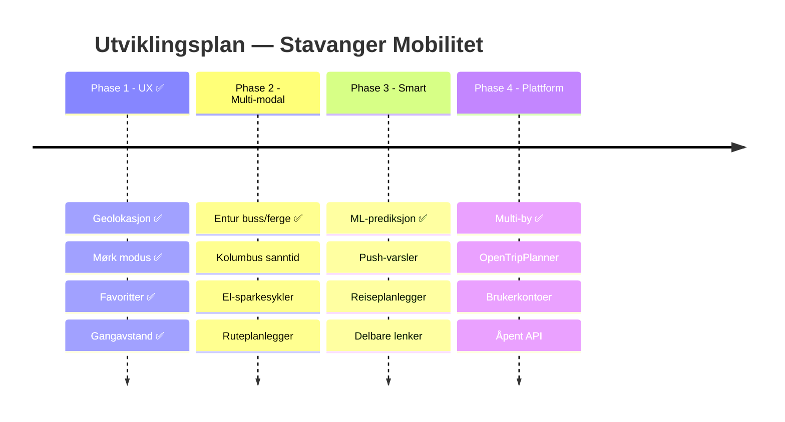

<!-- markdownlint-disable MD003 MD013 MD022 MD024 MD025 MD033 -->
<!-- MD025: Slidev uses # per slide (multiple h1 by design) -->
<!-- MD003: Slidev --- separators are misread as setext headings -->

<div class="flex flex-col items-center justify-center h-full">
  <div class="cover-title mb-4">Stavanger Mobilitet</div>
  <div class="cover-subtitle mb-8">Sanntids parkering, bysykler og kollektivtransport — på ett kart</div>

  <div class="flex gap-3 mb-8">
    <span class="feature-pill">🏙️ 4 byer</span>
    <span class="feature-pill">✨ 10+ funksjoner</span>
    <span class="feature-pill">🤖 100% AI-drevet</span>
  </div>

  <div class="text-sm opacity-40">
    Bouvet AI Hack · Team 8 · 11. mars 2026
  </div>
</div>

<div class="abs-br m-6">
  <a href="https://github.com/Bouvet-deler/aihack-team8" target="_blank" class="text-xl slidev-icon-btn opacity-40 !border-none !hover:text-white">
    <carbon-logo-github />
  </a>
</div>

---
layout: two-cols
layoutClass: gap-8
---

# Problemet 🎯

<div class="mt-2">

Stavangers innbyggere trenger **én plass** for å finne:

<div class="mt-4 space-y-2">
  <div class="glass-sm flex items-center gap-3">🅿️ <span>Ledig parkering i sanntid</span></div>
  <div class="glass-sm flex items-center gap-3">🚲 <span>Tilgjengelige bysykler</span></div>
  <div class="glass-sm flex items-center gap-3">🚌 <span>Buss- og fergeavganger</span></div>
  <div class="glass-sm flex items-center gap-3">📍 <span>Hva som er <b>nærmest meg</b></span></div>
</div>

<div class="divider mt-4"></div>

<div class="text-sm opacity-60 mt-2">
Informasjonen er spredt over ulike apper og nettsider. Ingen viser <b>alt</b> på ett kart.
</div>

</div>

::right::

<div class="mt-10">

## Ingen dekker Stavanger

| Løsning     | 🅿️ | 🚲 | 🚌 | Stavanger |
| ----------- | :-: | :-: | :-: | :-------: |
| Citymapper  | ❌  | ✅  | ✅  |    ❌     |
| Moovit      | ❌  | ❌  | ✅  |    ⚠️     |
| SpotHero    | ✅  | ❌  | ❌  |    ❌     |
| Parkopedia  | ✅  | ❌  | ❌  |    ⚠️     |
| Entur       | ❌  | ❌  | ✅  |    ✅     |
| **Vår app** | ✅  | ✅  | ✅  |  **✅**   |

</div>

---

# Hva vi har bygget ✨

<div class="grid grid-cols-2 gap-8 mt-2">

<div class="glass">

## Kjernefunksjoner

<div class="mt-3 space-y-2 text-sm">
  <div>🗺️ Interaktivt kart — <b>parkering + sykkel + buss</b></div>
  <div>🎨 Fargekodede markører <span class="text-green-400">grønn</span> → <span class="text-red-400">rød</span></div>
  <div>🔍 Søk og filtrering</div>
  <div>📱 PWA — installerbar på mobil</div>
  <div>🌍 Flerspråklig (NO / EN / ES)</div>
  <div>🔄 Auto-oppdatering av data</div>
</div>

</div>

<div class="glass">

## Nye i denne hacken

<div class="mt-3 space-y-2 text-sm">
  <div>🌙 <b>Mørk modus</b> — respekterer system-tema</div>
  <div>⭐ <b>Favoritter</b> — lagre favorittplasser</div>
  <div>📏 <b>Gangavstand</b> — tid og distanse</div>
  <div>📍 <b>Geolokasjon</b> — vis min posisjon</div>
  <div>📈 <b>Prediksjon</b> — forutsi ledige plasser</div>
  <div>🏙️ <b>4 byer</b> — Stavanger, Bergen, Trondheim, Oslo</div>
</div>

<div class="divider"></div>
<div class="text-xs text-green-400">✅ Phase 1 komplett + deler av Phase 2–4</div>

</div>
</div>

---
layout: center
class: text-center
---

# Tech Stack 🛠️

<div class="grid grid-cols-4 gap-6 mt-6">
  <div class="tech-tile">
    <div class="tech-icon">⚛️</div>
    <div class="tech-name">React 19</div>
    <div class="tech-desc">UI Framework</div>
  </div>
  <div class="tech-tile">
    <div class="tech-icon">⚡</div>
    <div class="tech-name">Vite 6</div>
    <div class="tech-desc">Build & Dev</div>
  </div>
  <div class="tech-tile">
    <div class="tech-icon">🗺️</div>
    <div class="tech-name">Leaflet</div>
    <div class="tech-desc">Kart</div>
  </div>
  <div class="tech-tile">
    <div class="tech-icon">🎨</div>
    <div class="tech-name">EDS</div>
    <div class="tech-desc">Equinor Design</div>
  </div>
</div>

<div class="grid grid-cols-4 gap-6 mt-4">
  <div class="tech-tile">
    <div class="tech-icon">📦</div>
    <div class="tech-name">PWA</div>
    <div class="tech-desc">Workbox + Offline</div>
  </div>
  <div class="tech-tile">
    <div class="tech-icon">🌍</div>
    <div class="tech-name">i18next</div>
    <div class="tech-desc">3 språk</div>
  </div>
  <div class="tech-tile">
    <div class="tech-icon">📊</div>
    <div class="tech-name">Open Data</div>
    <div class="tech-desc">opencom.no + Entur</div>
  </div>
  <div class="tech-tile">
    <div class="tech-icon">🔒</div>
    <div class="tech-name">TypeScript</div>
    <div class="tech-desc">Strict mode</div>
  </div>
</div>

---

# AI-drevet utvikling 🤖

<div class="text-sm opacity-70 mb-4">Copilot CLI var med i <b>hele arbeidsflyten</b> — ikke bare koding</div>

<div class="grid grid-cols-2 gap-6">
<div class="glass">

## Hva AI gjorde for oss

| Oppgave           | Resultat                        |
| ----------------- | ------------------------------- |
| Kodeanalyse       | Utforsket kodebasen på minutter |
| Konkurrentanalyse | 7 plattformer analysert         |
| Prosjektplan      | 26 Issues m/ akseptansekriterier |
| CI/CD             | Super-linter + Lefthook         |
| Kodekvalitet      | CSS + alle lint-feil fikset     |
| Dokumentasjon     | README, CONTRIBUTING, Slidev    |
| Testing           | UAT-template + Playwright       |
| Deep research     | 4 rapporter, 62 000+ ord        |

</div>
<div class="glass">

## AI som utviklingspartner

<div class="gradient-card mt-2">

```text
Copilot CLI ≠ kodegenerator

Copilot CLI = utviklingspartner som:

✓ Analyserer kodebasen
✓ Planlegger arkitektur
✓ Skriver og fikser kode
✓ Setter opp CI/CD
✓ Kjører tester
✓ Dokumenterer

Alt fra terminalen — ingen kontekst-
bytting mellom verktøy.
```

</div>

</div>
</div>

---

# AI-drevet research 🔬

<div class="text-sm opacity-70 mb-3">Copilot CLI utførte <b>4 dype research-analyser</b> — fra markedsanalyse til presentasjonsdesign</div>

<div class="grid grid-cols-2 gap-5">

<div class="glass">

## Konkurranseanalyse

<div class="text-sm mt-2">7 plattformer analysert: Citymapper, Moovit, Digitransit, SpotHero, Parkopedia, CityBikes, Entur</div>

<div class="divider"></div>

<div class="text-xs opacity-60">→ Konklusjon: Ingen dekker Stavanger med P + 🚲 + 🚌 samlet</div>

</div>

<div class="glass">

## Utviklingskostnader

<div class="text-sm mt-2">CI-kostnad, verktøy-overlap, DRY-analyse og pre-commit vs. CI-strategi</div>

<div class="divider"></div>

<div class="text-xs opacity-60">→ Resultat: Lefthook + Super-linter, ~$0.37 i CI-kostnader</div>

</div>

<div class="glass">

## Presentasjonsteknikk

<div class="text-sm mt-2">Narrativ struktur, visuell design, Slidev-teknikker, timing og leveranse</div>

<div class="divider"></div>

<div class="text-xs opacity-60">→ Rammeverk: Problem → Løsning → Bevis → Visjon</div>

</div>

<div class="glass">

## Ren Markdown i Slidev

<div class="text-sm mt-2">Comark/MDC-syntax, UnoCSS attributify, scoped styles — eliminere HTML</div>

<div class="divider"></div>

<div class="text-xs opacity-60">→ Funn: ~70% av HTML kan erstattes med ren Markdown</div>

</div>

</div>

---

# Copilot CLI i praksis 📸

<div class="flex justify-center mt-2">

</div>

<div class="text-xs opacity-40 mt-3 text-center">
Copilot CLI gjør konkurranseanalyse, søker GitHub-repos og analyserer markedet — direkte i terminalen
</div>

---

# Kvalitetssikring ✅

<div class="grid grid-cols-2 gap-8 mt-2">

<div class="glass">

## Automatisert UAT (Playwright)

<div class="grid grid-cols-3 gap-3 mt-4">
<div class="stat-card">
  <div class="stat-value text-green-400">57</div>
  <div class="stat-label">Bestått</div>
</div>
<div class="stat-card">
  <div class="stat-value text-red-400">12</div>
  <div class="stat-label">Feil*</div>
</div>
<div class="stat-card">
  <div class="stat-value text-yellow-400">3</div>
  <div class="stat-label">Skipped</div>
</div>
</div>

<div class="divider"></div>

<div class="text-xs opacity-50">
* CSP-header + Leaflet DivIcon i headless — fungerer i ekte nettleser
</div>

</div>

<div class="glass">

## CI/CD Pipeline

<div class="mt-3 space-y-3 text-sm">

<div class="glass-sm">
🥊 <b>Lefthook</b> — pre-commit hooks (parallell)<br>
<span class="text-xs opacity-60">prettier · markdownlint · stylelint · tsc</span>
</div>

<div class="glass-sm">
🔍 <b>Super-linter</b> v8.3.1 — GitHub Actions<br>
<span class="text-xs opacity-60">CSS · HTML · JSON · Markdown · YAML · Actions</span>
</div>

<div class="glass-sm">
📝 <b>Docs-as-code</b> — alt versjonskontrollert<br>
<span class="text-xs opacity-60">README · CONTRIBUTING · Slidev · UAT</span>
</div>

</div>

</div>
</div>

---

# Utviklingskostnad 💰

<div class="text-sm opacity-70 mb-2">Mennesker jobber gratis — hva koster AI og infrastruktur?</div>

<div class="grid grid-cols-2 gap-6">

<div class="glass">

## Kostnader

| Post                    |   Kostnad |
| ----------------------- | --------: |
| Knut — Claude API       |   $43.13  |
| Einar — Copilot CLI     |     $0\*  |
| GitHub Actions (46 min) |    $0.37  |
| Copilot × 2 seter       |  $38/mnd  |
| Hosting                 |       $0  |

<div class="text-xs opacity-50 mt-1">* Copilot Business inkludert i abonnement</div>

</div>

<div class="glass">

## AI-bidrag i tall

| Metrikk          |      Verdi |
| ---------------- | ---------: |
| Totale commits   |         61 |
| AI co-authored   |   47 (77%) |
| — Copilot        |         34 |
| — Claude         |         18 |
| Kodelinjer (src) |      3 146 |

<div class="gradient-card mt-2 text-center">
<b class="text-lg">~$81 + $38/mnd</b><br>
<span class="text-xs opacity-60">→ 3 146 LOC, full CI/CD, 4 byer</span>
</div>

</div>
</div>

---

# GitHub Project Status 📋

<div class="grid grid-cols-2 gap-6 mt-2">

<div class="glass">

## Issues (26 + 2 test)

| Status           | Antall |
| ---------------- | :----: |
| ✅ Lukket         |     6  |
| 📋 Åpen (P1–P4)  |    17  |
| 🧪 Test-issues   |     2  |

<div class="divider"></div>

<div class="text-xs opacity-60">
✅ geolokasjon · dark mode · favoritter · gangavstand · prediksjon · multi-city
</div>

</div>

<div class="glass">

## Teamets bidrag

<div class="glass-sm mt-3">
<div class="font-bold text-sky-400 mb-1">Knut Erik — Funksjoner</div>
<div class="text-sm opacity-80">i18n · dark mode · favoritter · gangavstand · geolokasjon · prediksjon · multi-city · Entur transit</div>
</div>

<div class="glass-sm mt-2">
<div class="font-bold text-emerald-400 mb-1">Einar — AI & Kvalitet</div>
<div class="text-sm opacity-80">Copilot CLI prosjektledelse · konkurranseanalyse · 26 issues · CI/CD · docs · UAT</div>
</div>

</div>
</div>

---

# Veikart 🗺️

<div class="mt-2">



</div>

---
layout: two-cols
layoutClass: gap-8
---

# Neste steg 🚀

## Phase 2: Multi-modal hub

<div class="text-sm opacity-70 mb-3">Gjøre appen til <b>den</b> mobilitetsappen for Stavanger</div>

<div class="space-y-2">
  <div class="glass-sm">🚏 <b>Kolumbus sanntid</b></div>
  <div class="glass-sm">🛴 <b>El-sparkesykler</b></div>
  <div class="glass-sm">🗺️ <b>Ruteplanlegger</b></div>
  <div class="glass-sm">⚡ <b>Elbil-lading</b></div>
  <div class="glass-sm">♿ <b>WCAG 2.1 AA</b></div>
</div>

::right::

<div class="mt-10">

## Allerede levert utover Phase 1

<div class="space-y-2 mt-3">

<div class="gradient-card">
🏙️ <b>Multi-city</b> — Bergen, Trondheim, Oslo
<span class="badge badge-amber ml-1">Phase 4</span>
</div>

<div class="gradient-card">
📈 <b>Prediksjon</b> — forutsi tilgjengelighet
<span class="badge badge-amber ml-1">Phase 3</span>
</div>

<div class="gradient-card">
🚌 <b>Entur API</b> — buss/ferge-data
<span class="badge badge-green ml-1">Phase 2</span>
</div>

<div class="gradient-card">
🔍 <b>CI/CD</b> — Super-linter + Lefthook
<span class="badge badge-blue ml-1">Infra</span>
</div>

</div>

<div class="text-xs opacity-40 mt-3">
Inspirasjon: Digitransit 🇫🇮 + Entur 🇳🇴
</div>

</div>

---
layout: center
class: text-center
---

# Takk! 🙌

<div class="mt-4">
  <div class="cover-subtitle">
    <b>Stavanger Mobilitet</b> — parkering, bysykler og kollektiv, ett kart
  </div>
</div>

<div class="flex gap-3 justify-center mt-6">
  <span class="feature-pill">🏙️ 4 byer</span>
  <span class="feature-pill">🌍 3 språk</span>
  <span class="feature-pill">📋 26 issues</span>
  <span class="feature-pill">🤖 100% AI-drevet</span>
</div>

<div class="mt-6 text-sm opacity-50">
Team 8: <b>Einar Fredriksen</b> & <b>Knut Erik Hollund</b><br>
Bouvet AI Hack · 11. mars 2026
</div>

<div class="mt-6">
  <a href="https://github.com/Bouvet-deler/aihack-team8" target="_blank" class="px-5 py-2.5 rounded-lg bg-white/5 border border-white/10 text-white text-sm hover:bg-white/10 transition-all inline-flex items-center gap-2">
    <carbon-logo-github /> GitHub Repo
  </a>
</div>
