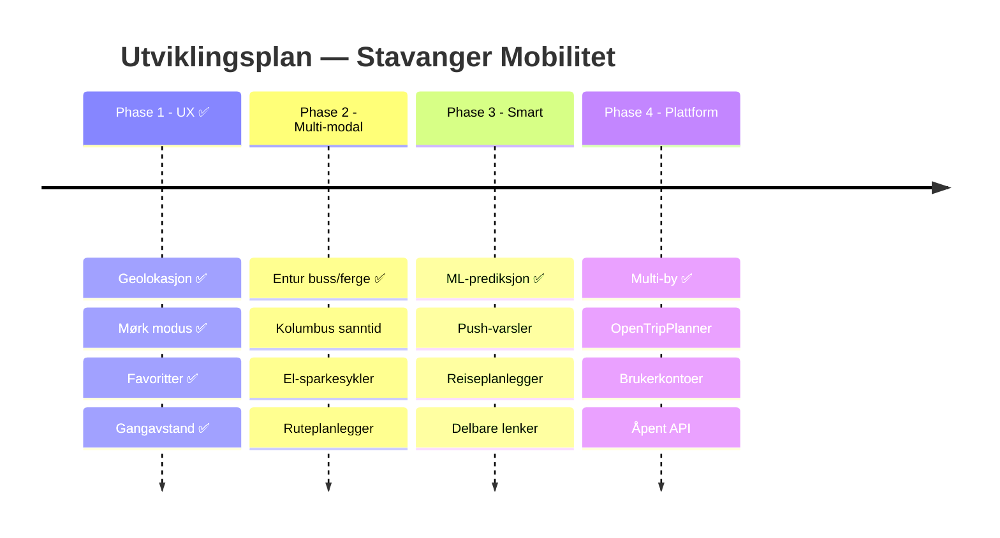

<!-- markdownlint-disable MD003 MD013 MD022 MD024 MD025 MD033 -->
<!-- MD025: Slidev uses # per slide (multiple h1 by design) -->
<!-- MD003: Slidev --- separators are misread as setext headings -->

# Stavanger Mobilitet 🚗🚲

Sanntids parkering, bysykler og kollektivtransport — på ett kart

<div class="pt-6 text-sm opacity-70">
Bouvet AI Hack · Team 8 · 11. mars 2026
</div>

<div class="pt-2 text-xs opacity-50">
4 byer · 10+ funksjoner · 100% AI-drevet utvikling
</div>

<div class="abs-br m-6 flex gap-2">
  <a href="https://github.com/Bouvet-deler/aihack-team8" target="_blank" class="text-xl slidev-icon-btn opacity-50 !border-none !hover:text-white">
    <carbon-logo-github />
  </a>
</div>

---
layout: two-cols
layoutClass: gap-8
---

# Problemet 🎯

Stavangers innbyggere trenger **én plass** for å finne:

- 🅿️ Ledig parkering i sanntid
- 🚲 Tilgjengelige bysykler
- 🚌 Buss- og fergeavganger
- 📍 Hva som er **nærmest meg**

<br>

## I dag

Informasjonen er spredt over ulike apper og nettsider. Ingen viser **alt** på ett kart.

::right::

<div class="mt-12">

## Ingen dekker Stavanger

| Løsning     | Parkering | Sykkel | Kollektiv | Stavanger |
| ----------- | :-------: | :----: | :-------: | :-------: |
| Citymapper  |    ❌     |   ✅   |    ✅     |    ❌     |
| Moovit      |    ❌     |   ❌   |    ✅     |    ⚠️     |
| SpotHero    |    ✅     |   ❌   |    ❌     |    ❌     |
| Parkopedia  |    ✅     |   ❌   |    ❌     |    ⚠️     |
| Entur       |    ❌     |   ❌   |    ✅     |    ✅     |
| **Vår app** |  **✅**   | **✅** |  **✅**   |  **✅**   |

</div>

---

# Hva vi har bygget ✨

<div class="grid grid-cols-2 gap-6 mt-4">

<div>

## Kjernefunksjoner

- 🗺️ Interaktivt kart med **parkering + sykkel + buss**
- 🎨 Fargekodede markører (grønn → rød)
- 🔍 Søk og filtrering
- 📱 PWA — installerbar på mobil
- 🌍 Flerspråklig (NO / EN / ES)
- 🔄 Auto-oppdatering av data

</div>

<div>

## Nye i denne hacken

- 🌙 **Mørk modus** — respekterer system-tema
- ⭐ **Favoritter** — lagre favorittplasser
- 📏 **Gangavstand** — tid og distanse
- 📍 **Geolokasjon** — vis min posisjon
- 📈 **Prediksjon** — forutsi ledige plasser
- 🏙️ **4 byer** — Stavanger, Bergen, Trondheim, Oslo

<div class="mt-3 p-3 bg-green-500/10 rounded text-sm">
✅ Phase 1 komplett + deler av Phase 2–4 levert
</div>

</div>
</div>

---
layout: center
class: text-center
---

# Tech Stack 🛠️

<div class="grid grid-cols-4 gap-8 mt-8 text-center">
<div>
  <div class="text-4xl mb-2">⚛️</div>
  <div class="font-bold">React 19</div>
  <div class="text-xs opacity-60">UI Framework</div>
</div>
<div>
  <div class="text-4xl mb-2">⚡</div>
  <div class="font-bold">Vite 6</div>
  <div class="text-xs opacity-60">Build & Dev</div>
</div>
<div>
  <div class="text-4xl mb-2">🗺️</div>
  <div class="font-bold">Leaflet</div>
  <div class="text-xs opacity-60">Kart</div>
</div>
<div>
  <div class="text-4xl mb-2">🎨</div>
  <div class="font-bold">EDS</div>
  <div class="text-xs opacity-60">Equinor Design System</div>
</div>
</div>

<div class="grid grid-cols-4 gap-8 mt-8 text-center">
<div>
  <div class="text-4xl mb-2">📦</div>
  <div class="font-bold">PWA</div>
  <div class="text-xs opacity-60">Workbox + Offline</div>
</div>
<div>
  <div class="text-4xl mb-2">🌍</div>
  <div class="font-bold">i18next</div>
  <div class="text-xs opacity-60">3 språk</div>
</div>
<div>
  <div class="text-4xl mb-2">📊</div>
  <div class="font-bold">Open Data</div>
  <div class="text-xs opacity-60">opencom.no + Entur</div>
</div>
<div>
  <div class="text-4xl mb-2">🔒</div>
  <div class="font-bold">TypeScript</div>
  <div class="text-xs opacity-60">Strict mode</div>
</div>
</div>

---

# AI-drevet utvikling 🤖

Copilot CLI var med i **hele arbeidsflyten** — ikke bare koding

<div class="grid grid-cols-2 gap-6 mt-4">
<div>

## Hva AI gjorde for oss

| Oppgave             | Resultat                             |
| ------------------- | ------------------------------------ |
| Kodeanalyse         | Utforsket kodebasen på minutter      |
| Konkurrentanalyse   | 7 plattformer analysert              |
| Prosjektplanlegging | 26 Issues med akseptansekriterier    |
| CI/CD               | Super-linter + Lefthook              |
| Kodekvalitet        | CSS + alle lint-feil fikset          |
| Dokumentasjon       | README, CONTRIBUTING, Slidev         |
| Testing             | UAT-template + Playwright            |

</div>
<div>

## AI som utviklingspartner

```text
Copilot CLI ≠ kodegenerator

Copilot CLI = utviklingspartner som:

✓ Analyserer kodebasen
✓ Planlegger arkitektur
✓ Skriver og fikser kode
✓ Setter opp CI/CD
✓ Kjører tester
✓ Dokumenterer

Alt fra terminalen — ingen kontekst-
bytting mellom verktøy.
```

</div>
</div>

---

# Copilot CLI i praksis 📸


<div class="text-xs opacity-50 mt-2 text-center">
Copilot CLI gjør konkurranseanalyse, søker GitHub-repos og analyserer markedet — direkte i terminalen
</div>

---

# Kvalitetssikring ✅

<div class="grid grid-cols-2 gap-8 mt-4">

<div>

## Automatisert UAT (Playwright)

<div class="grid grid-cols-3 gap-3 mt-4">
<div class="p-3 bg-green-500/15 rounded-lg text-center">
  <div class="text-3xl font-bold text-green-400">57</div>
  <div class="text-xs mt-1">Bestått</div>
</div>
<div class="p-3 bg-red-500/15 rounded-lg text-center">
  <div class="text-3xl font-bold text-red-400">12</div>
  <div class="text-xs mt-1">Feil*</div>
</div>
<div class="p-3 bg-yellow-500/15 rounded-lg text-center">
  <div class="text-3xl font-bold text-yellow-400">3</div>
  <div class="text-xs mt-1">Skipped</div>
</div>
</div>

<div class="mt-3 text-xs">

\* CSP-header + Leaflet DivIcon i headless browser — fungerer i ekte nettleser

</div>

</div>

<div>

## CI/CD Pipeline

<div class="mt-4 space-y-3 text-sm">

🥊 **Lefthook** pre-commit hooks (parallell)

- prettier, markdownlint, stylelint, tsc

🔍 **Super-linter** v8.3.1 i GitHub Actions

- CSS, HTML, JSON, Markdown, YAML, Actions

📝 **Docs-as-code** — alt versjonskontrollert

- README, CONTRIBUTING, Slidev, UAT-templates

</div>

</div>
</div>

---

# Utviklingskostnad 💰

Mennesker jobber gratis — hva koster AI og infrastruktur?

<div class="grid grid-cols-2 gap-6 mt-2">

<div>

## Kostnader

| Post                    | Kostnad    |
| ----------------------- | ---------: |
| Knut — Claude API       |    $43.13  |
| Einar — Copilot CLI     |      $0\*  |
| GitHub Actions (46 min) |     $0.37  |
| Copilot × 2 seter       |   $38/mnd  |
| Hosting                 |        $0  |

<div class="mt-2 text-xs opacity-60">

\* Copilot Business inkludert i abonnement

</div>

</div>

<div>

## AI-bidrag i tall

| Metrikk          |      Verdi |
| ---------------- | ---------: |
| Totale commits   |         61 |
| AI co-authored   |   47 (77%) |
| — Copilot        |         34 |
| — Claude         |         18 |
| Kodelinjer (src) |      3 146 |

<div class="mt-2 p-2 bg-green-500/10 rounded text-sm">
<b>~$81 + $38/mnd</b> → 3 146 LOC, full CI/CD
</div>

</div>
</div>

---

# GitHub Project Status 📋

<div class="grid grid-cols-2 gap-8 mt-4">

<div>

## Issues (26 totalt + 2 test-issues)

| Status             | Antall |
| ------------------ | :----: |
| ✅ Lukket           |   6    |
| 📋 Åpen (Phase 1)  |   2    |
| 📋 Åpen (Phase 2)  |   6    |
| 📋 Åpen (Phase 3)  |   4    |
| 📋 Åpen (Phase 4)  |   5    |
| 🧪 Test-issues     |   2    |

<div class="mt-3 p-2 bg-green-500/10 rounded text-xs">
✅ Lukket: geolokasjon, dark mode, favoritter, gangavstand, prediksjon, multi-city
</div>

</div>

<div>

## Teamets bidrag

**Knut Erik** (knu73r1k) — Funksjoner

- i18n (NO/EN/ES), dark mode, favoritter
- Gangavstand, geolokasjon
- Prediksjonschart, multi-city
- Entur transit-integrasjon

**Einar** (einaren) — AI & Kvalitet

- Prosjektledelse med Copilot CLI
- Konkurranseanalyse, 26 feature issues
- CI/CD (super-linter, lefthook)
- Kodekvalitet, docs, UAT testing

</div>
</div>

---

# Veikart 🗺️

<div class="mt-4">



</div>

---
layout: two-cols
layoutClass: gap-8
---

# Neste steg 🚀

## Phase 2: Multi-modal hub

Gjøre appen til **den** mobilitetsappen for Stavanger

<div class="mt-2 space-y-1 text-sm">

🚏 **Kolumbus sanntid** · 🛴 **El-sparkesykler** · 🗺️ **Ruteplanlegger**

⚡ **Elbil-lading** · 📋 **Avgangstavler** · ♿ **WCAG 2.1 AA**

</div>

::right::

<div class="mt-12">

## Allerede levert utover Phase 1

<div class="space-y-2 text-sm">

<div class="p-2 bg-blue-500/10 rounded">
🏙️ <b>Multi-city</b> — Bergen, Trondheim, Oslo (Phase 4)
</div>

<div class="p-2 bg-purple-500/10 rounded">
📈 <b>Prediksjon</b> — forutsi tilgjengelighet (Phase 3)
</div>

<div class="p-2 bg-green-500/10 rounded">
🚌 <b>Entur API</b> — buss/ferge-data (Phase 2)
</div>

<div class="p-2 bg-orange-500/10 rounded">
🔍 <b>CI/CD</b> — Super-linter + Lefthook + Prettier
</div>

</div>

<div class="mt-3 text-xs opacity-60">
Inspirasjon: Digitransit 🇫🇮 + Entur 🇳🇴
</div>

</div>

---
layout: center
class: text-center
---

# Takk! 🙌

<div class="mt-6 text-lg">

**Stavanger Mobilitet** — parkering, bysykler og kollektiv, ett kart

</div>

<div class="mt-2 text-sm opacity-70">

4 byer · 3 språk · 26 issues · 100% AI-drevet

</div>

<div class="mt-4 text-sm opacity-70">

Team 8: **Einar Fredriksen** & **Knut Erik Hollund**

Bouvet AI Hack · 11. mars 2026

</div>

<div class="mt-6 flex gap-4 justify-center">
  <a href="https://github.com/Bouvet-deler/aihack-team8" target="_blank" class="px-4 py-2 rounded bg-gray-700 text-white text-sm hover:bg-gray-600">
    <carbon-logo-github class="inline mr-1" /> GitHub Repo
  </a>
</div>
