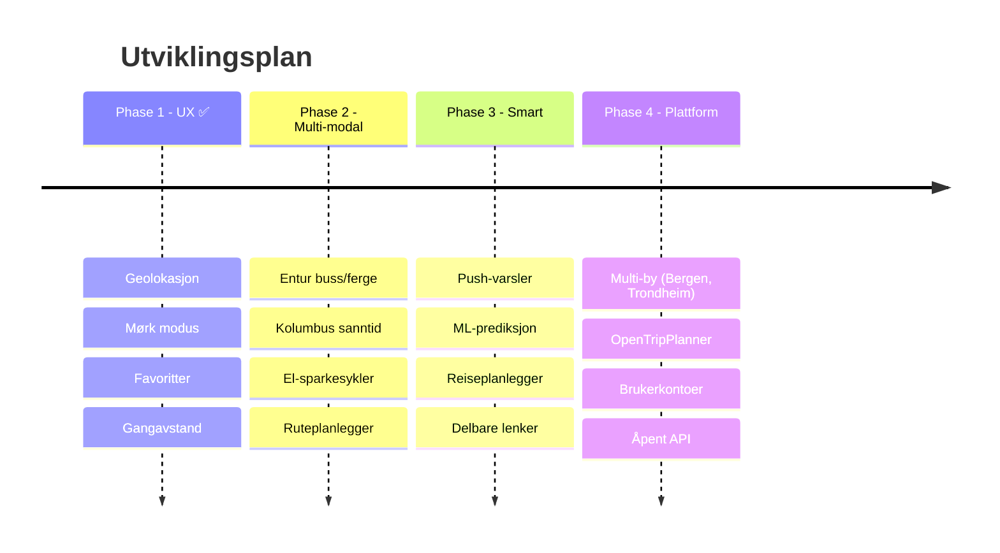

<!-- markdownlint-disable MD025 MD003 -->
<!-- MD025: Slidev uses # per slide (multiple h1 by design) -->
<!-- MD003: Slidev --- separators are misread as setext headings -->

# Stavanger Mobilitet 🚗🚲

Real-time parking & bike availability for Stavanger

<div class="pt-8 text-sm opacity-70">
Bouvet AI Hack · Team 8 · 11. mars 2026
</div>

<div class="abs-br m-6 flex gap-2">
  <a href="https://github.com/Bouvet-deler/aihack-team8" target="_blank" class="text-xl slidev-icon-btn opacity-50 !border-none !hover:text-white">
    <carbon-logo-github />
  </a>
</div>

---
layout: two-cols
layoutClass: gap-8
---

# Problemet 🎯

Stavangers innbyggere trenger **én plass** for å finne:

- 🅿️ Ledig parkering i sanntid
- 🚲 Tilgjengelige bysykler
- 📍 Hva som er **nærmest meg**

<br>

## I dag

Informasjonen er spredt over ulike apper og nettsider. Ingen viser **begge deler** på ett kart.

::right::

<div class="mt-12">

## Ingen dekker Stavanger

| Løsning | Parkering | Sykkel | Stavanger |
|---------|:---------:|:------:|:---------:|
| Citymapper | ❌ | ✅ | ❌ |
| Moovit | ❌ | ❌ | ⚠️ |
| SpotHero | ✅ | ❌ | ❌ |
| Parkopedia | ✅ | ❌ | ⚠️ |
| CityBikes | ❌ | ✅ | ❌ |
| **Vår app** | **✅** | **✅** | **✅** |

</div>

---

# Hva vi har bygget ✨

<div class="grid grid-cols-2 gap-6 mt-4">

<div>

## Kjernefunksjoner
- 🗺️ Interaktivt kart med **parkering + sykkel**
- 🎨 Fargekodede markører (grønn → rød)
- 🔍 Søk og filtrering
- 📱 PWA — installerbar på mobil
- 🌍 Flerspråklig (NO / EN / ES)
- 🔄 Auto-oppdatering av data

</div>

<div>

## Nye funksjoner (Phase 1 ✅)
- 🌙 **Mørk modus** — respekterer system-tema
- ⭐ **Favoritter** — lagre favorittplasser
- 📏 **Gangavstand** — tid og distanse
- 📍 **Geolokasjon** — vis min posisjon

<div class="mt-4 p-3 bg-green-500/10 rounded text-sm">
✅ Alle 4 Phase 1-issues lukket
</div>

</div>
</div>

---
layout: center
class: text-center
---

# Tech Stack 🛠️

<div class="grid grid-cols-4 gap-8 mt-8 text-center">
<div>
  <div class="text-4xl mb-2">⚛️</div>
  <div class="font-bold">React 19</div>
  <div class="text-xs opacity-60">UI Framework</div>
</div>
<div>
  <div class="text-4xl mb-2">⚡</div>
  <div class="font-bold">Vite</div>
  <div class="text-xs opacity-60">Build & Dev</div>
</div>
<div>
  <div class="text-4xl mb-2">🗺️</div>
  <div class="font-bold">Leaflet</div>
  <div class="text-xs opacity-60">Kart</div>
</div>
<div>
  <div class="text-4xl mb-2">🎨</div>
  <div class="font-bold">EDS</div>
  <div class="text-xs opacity-60">Equinor Design System</div>
</div>
</div>

<div class="grid grid-cols-3 gap-8 mt-8 text-center">
<div>
  <div class="text-4xl mb-2">📦</div>
  <div class="font-bold">PWA</div>
  <div class="text-xs opacity-60">Workbox + Offline</div>
</div>
<div>
  <div class="text-4xl mb-2">🌍</div>
  <div class="font-bold">i18next</div>
  <div class="text-xs opacity-60">Internasjonalisering</div>
</div>
<div>
  <div class="text-4xl mb-2">📊</div>
  <div class="font-bold">Open Data</div>
  <div class="text-xs opacity-60">opencom.no API</div>
</div>
</div>

---

# AI-drevet utvikling 🤖

Copilot CLI var med i **hele arbeidsflyten** — ikke bare koding

<div class="grid grid-cols-2 gap-6 mt-6">
<div>

## Hva AI gjorde for oss

| Oppgave | Verktøy |
|---------|---------|
| Kodeanalyse | Utforsket hele kodebasen på minutter |
| Konkurrentanalyse | 7 globale plattformer analysert |
| Prosjektplanlegging | 24 GitHub Issues med akseptansekriterier |
| Kvalitetssikring | UAT-template + automatisert testing |
| Presentasjon | Denne Slidev-presentasjonen |

</div>
<div>

## Eksempel: Konkurrentanalyse

```text
> /review liknende løsninger i verden
  og foreslå neste steg

→ Analyserte Citymapper, Moovit,
  Digitransit, SpotHero, Parkopedia,
  CityBikes, Entur

→ Identifiserte at ingen konkurrent
  dekker Stavanger med BÅDE parkering
  OG sykkel

→ Anbefalte Digitransit-modellen
  (nordisk, open source, React)
```

</div>
</div>

---

# Copilot CLI i praksis 📸


<div class="text-xs opacity-50 mt-2 text-center">
Copilot CLI gjør konkurranseanalyse, søker GitHub-repos og analyserer markedet — direkte i terminalen
</div>

---

# Kvalitetssikring ✅

Automatisert UAT-test med **Playwright** mot 14 kategorier

<div class="grid grid-cols-3 gap-4 mt-6">

<div class="p-4 bg-green-500/15 rounded-lg text-center">
  <div class="text-4xl font-bold text-green-400">57</div>
  <div class="text-sm mt-1">Bestått</div>
</div>

<div class="p-4 bg-red-500/15 rounded-lg text-center">
  <div class="text-4xl font-bold text-red-400">12</div>
  <div class="text-sm mt-1">Feil*</div>
</div>

<div class="p-4 bg-yellow-500/15 rounded-lg text-center">
  <div class="text-4xl font-bold text-yellow-400">3</div>
  <div class="text-sm mt-1">Hoppet over</div>
</div>

</div>

<div class="mt-6 text-sm">

\* **Reelle feil:** CSP-header bør flyttes fra meta-tag til HTTP-header. PWA-manifest kun i prod.

**Resten:** Leaflet DivIcon + headless browser-begrensninger — fungerer i ekte nettleser.

**Verdict:** ⚠️ Betinget bestått — klar for produksjonsbygg-testing

</div>

---

# GitHub Project Status 📋

<div class="grid grid-cols-2 gap-8 mt-6">

<div>

## Issues

| Status | Antall |
|--------|:------:|
| ✅ Lukket | 4 |
| 📋 Åpen (Phase 1) | 4 |
| 📋 Åpen (Phase 2) | 6 |
| 📋 Åpen (Phase 3) | 6 |
| 📋 Åpen (Phase 4) | 6 |
| **Totalt** | **26** |

</div>

<div>

## Teamets bidrag

**Knut Erik** (knu73r1k)
- i18n (NO/EN/ES)
- Dark mode
- Favoritter
- Gangavstand
- Geolokasjon
- Walking time format fix

**Einar** (einaren)
- Prosjektledelse med AI
- Konkurranseanalyse
- 24 feature issues
- UAT testing & template

</div>
</div>

---

# Veikart 🗺️

<div class="mt-4">



</div>

---
layout: two-cols
layoutClass: gap-8
---

# Neste steg 🚀

## Phase 2: Multi-modal hub

Gjøre appen til **den** mobilitetsappen for Stavanger

<div class="mt-4 space-y-2 text-sm">

🚌 **Entur API** — buss og ferge-avganger

🚏 **Kolumbus sanntid** — holdeplassdata

🛴 **El-sparkesykler** — Ryde/Tier/Voi

🗺️ **Ruteplanlegger** — A til B navigasjon

⚡ **Elbil-lading** — ladepunkter på kartet

📋 **Avgangstavler** — i markør-popups

</div>

::right::

<div class="mt-12">

## Arkitektur-inspirasjon

**Digitransit** (Helsinki) 🇫🇮
- Open source, React, Leaflet
- Nordisk kontekst
- Multi-modal
- Bevist i produksjon

<br>

**Entur** (Norge) 🇳🇴
- Gratis API-er
- Nasjonal transportdata
- Reiseplanlegger-motor

</div>

---
layout: center
class: text-center
---

# Takk! 🙌

<div class="mt-8 text-lg">

**Stavanger Mobilitet** — parkering og bysykler, ett kart

</div>

<div class="mt-4 text-sm opacity-70">

Team 8: **Einar Fredriksen** & **Knut Erik Hollund**

Bouvet AI Hack · 11. mars 2026

</div>

<div class="mt-8 flex gap-4 justify-center">
  <a href="https://github.com/Bouvet-deler/aihack-team8" target="_blank" class="px-4 py-2 rounded bg-gray-700 text-white text-sm hover:bg-gray-600">
    <carbon-logo-github class="inline mr-1" /> GitHub Repo
  </a>
</div>
